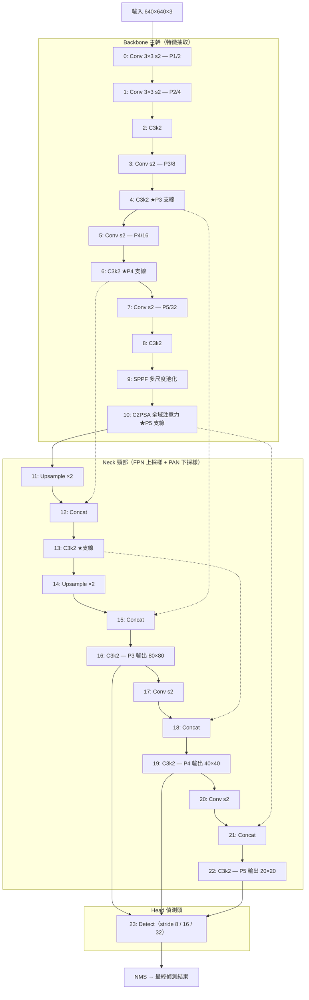
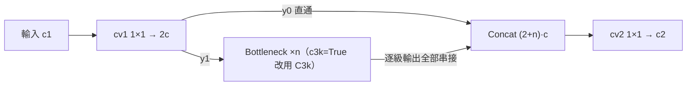
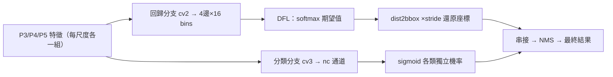

# YOLO11 基本架構說明

> 依據本 repo 的 [`yolo11.yaml`](../ultralytics_yolo11/cfg/models/11/yolo11.yaml) 與 `ultralytics_yolo11/nn/modules/` 原始碼整理。
> 整個模型共 24 層（編號 0–23）：主幹 backbone（層 0–10）＋ 頭部 head（層 11–23，其中 11–22 是頸部融合、23 是 `Detect`）。

---

## 1. 整體流程與模組清單

### 1.1 整體流程圖



資料流總結：

```
輸入 640×640×3
 → Backbone：5 次 stride-2 下採樣（P1→P5），Conv 與 C3k2 交替堆疊
 → SPPF：多尺度池化拿上下文
 → C2PSA：在最小特徵圖（20×20）上做全域注意力
 → FPN（上採樣路徑）：深層語意往高解析度傳，產生 P3 輸出
 → PAN（下採樣路徑）：淺層定位細節再往深層傳，產生 P4、P5 輸出
 → Detect：P3/P4/P5 各自做「框回歸 + 分類」→ NMS → 最終結果
```

### 1.2 逐層對照表

通道數為 yaml 標稱值；括號內是 n 規模（depth=0.5、width=0.25）、640 輸入時的實際輸出。「×2」是 yaml 的 repeats，n 規模會乘上 depth=0.5 變成 ×1。

| 層 | 來源 | 模組 | 參數 | 輸出（n 規模） |
|---|---|---|---|---|
| 0 | -1 | `Conv` | 64, 3×3, s2 | 320²×16（P1/2） |
| 1 | -1 | `Conv` | 128, 3×3, s2 | 160²×32（P2/4） |
| 2 | -1 | `C3k2` ×2 | 256, c3k=False, e=0.25 | 160²×64 |
| 3 | -1 | `Conv` | 256, 3×3, s2 | 80²×64（P3/8） |
| 4 | -1 | `C3k2` ×2 | 512, c3k=False, e=0.25 | 80²×128 ★P3 支線 |
| 5 | -1 | `Conv` | 512, 3×3, s2 | 40²×128（P4/16） |
| 6 | -1 | `C3k2` ×2 | 512, c3k=True | 40²×128 ★P4 支線 |
| 7 | -1 | `Conv` | 1024, 3×3, s2 | 20²×256（P5/32） |
| 8 | -1 | `C3k2` ×2 | 1024, c3k=True | 20²×256 |
| 9 | -1 | `SPPF` | 1024, k=5 | 20²×256 |
| 10 | -1 | `C2PSA` ×2 | 1024 | 20²×256 ★P5 支線 |
| 11 | -1 | `nn.Upsample` | ×2 nearest | 40²×256 |
| 12 | [-1, 6] | `Concat` | dim=1 | 40²×384 |
| 13 | -1 | `C3k2` ×2 | 512, c3k=False | 40²×128 ★支線 |
| 14 | -1 | `nn.Upsample` | ×2 nearest | 80²×128 |
| 15 | [-1, 4] | `Concat` | dim=1 | 80²×256 |
| 16 | -1 | `C3k2` ×2 | 256, c3k=False | 80²×64（P3 輸出） |
| 17 | -1 | `Conv` | 256, 3×3, s2 | 40²×64 |
| 18 | [-1, 13] | `Concat` | dim=1 | 40²×192 |
| 19 | -1 | `C3k2` ×2 | 512, c3k=False | 40²×128（P4 輸出） |
| 20 | -1 | `Conv` | 512, 3×3, s2 | 20²×128 |
| 21 | [-1, 10] | `Concat` | dim=1 | 20²×384 |
| 22 | -1 | `C3k2` ×2 | 1024, c3k=True | 20²×256（P5 輸出） |
| 23 | [16, 19, 22] | `Detect` | nc | 三尺度預測 |

### 1.3 模組清單與定義位置

| 模組 | 定義 | 出現位置 |
|---|---|---|
| `Conv` | [conv.py#L41](../ultralytics_yolo11/nn/modules/conv.py#L41) | 層 0,1,3,5,7,17,20，以及幾乎所有模組內部 |
| `C3k2` | [block.py#L1074](../ultralytics_yolo11/nn/modules/block.py#L1074) | 層 2,4,6,8,13,16,19,22 |
| `Bottleneck` | [block.py#L462](../ultralytics_yolo11/nn/modules/block.py#L462) | `C3k2`/`C3k` 內部 |
| `C3k` | [block.py#L1114](../ultralytics_yolo11/nn/modules/block.py#L1114) | c3k=True 的 `C3k2` 內部 |
| `SPPF` | [block.py#L213](../ultralytics_yolo11/nn/modules/block.py#L213) | 層 9 |
| `C2PSA`（含 `PSABlock`、`Attention`） | [block.py#L1576](../ultralytics_yolo11/nn/modules/block.py#L1576)、[#L1471](../ultralytics_yolo11/nn/modules/block.py#L1471)、[#L1411](../ultralytics_yolo11/nn/modules/block.py#L1411) | 層 10 |
| `nn.Upsample` | PyTorch 內建 | 層 11,14 |
| `Concat` | [conv.py#L757](../ultralytics_yolo11/nn/modules/conv.py#L757) | 層 12,15,18,21 |
| `Detect`（含 `DFL`） | [head.py#L26](../ultralytics_yolo11/nn/modules/head.py#L26)、[block.py#L63](../ultralytics_yolo11/nn/modules/block.py#L63) | 層 23 |

---

## 2. 各模組用途、所在位置與使用原因

### 2.1 Conv（基本卷積單元）

- **用途**：`Conv2d → BatchNorm → SiLU` 三合一，是全網路最底層的積木。
- **位置**：主幹中每次解析度減半（s2）都靠它；頸部 PAN 的下採樣（層 17、20）也用它；所有複合模組內部的 1×1、3×3 卷積全是它。
- **原因**：把卷積、正規化、激活綁成一個單元，訓練穩定（BN）且部署時可以把 BN 融合進卷積權重（`forward_fuse`）省一次運算。用「stride-2 卷積」而非池化來下採樣，是因為下採樣本身也能學特徵。

### 2.2 C3k2（CSP 特徵抽取塊，YOLO11 的主力）



- **用途**：在不改變解析度的情況下加深網路、抽取特徵。是 YOLO11 取代 v8 `C2f` 的新模組。
- **位置**：主幹每個解析度層級各一個（層 2,4,6,8），頸部每次 Concat 之後各一個（層 13,16,19,22）——因為 Concat 只是把通道疊起來，必須靠 `C3k2` 真正「融合」兩路特徵。
- **原因（位置相關的細節）**：
  - 淺層（層 2、4）解析度高、運算貴，所以 yaml 給 `e=0.25` 把內部通道砍到 1/4，並用 `c3k=False`（單一 `Bottleneck`，較便宜）。
  - 深層（層 6、8、22）解析度低、語意重要，用 `c3k=True` 換成更深的巢狀 `C3k` 區塊。
  - 另外 [tasks.py#L1679](../ultralytics_yolo11/nn/tasks.py#L1679) 在 m/l/x 規模會把所有 `C3k2` 強制 `c3k=True`——大模型有本錢吃更深的塊。

### 2.3 Bottleneck 與 C3k（C3k2 的內部零件）

- **用途**：`Bottleneck` 是「兩個 3×3 卷積 + 殘差」的最小殘差單元；`C3k` 是把多個 `Bottleneck` 再包一層 CSP 的「塊中塊」。
- **位置**：只存在於 `C3k2` 內部。
- **原因**：殘差連接讓深層網路能訓練（梯度可以直通），CSP 包裝讓計算量減半。

### 2.4 SPPF（空間金字塔池化—快速版）

- **用途**：用連續三次 5×5 MaxPool，等效一次取得 5/9/13 三種感受野的上下文，再融合。
- **位置**：只在層 9，主幹最末端（P5）。
- **原因**：到了 P5 每個像素已代表原圖 32×32 的區域，在這裡擴大感受野最便宜（特徵圖只有 20×20）；它讓同一層特徵能同時「看見」不同大小範圍，對大物件與全圖語意特別重要。放主幹末端是因為頸部接下來要把這份「全域摘要」往上分發給所有尺度。

### 2.5 C2PSA（Position-Sensitive Attention，YOLO11 新增）

- **用途**：CSP 包裝的多頭自注意力 + FFN，讓特徵圖上任兩個位置可以直接交換資訊（卷積只能看局部，注意力可看全圖）。
- **位置**：只在層 10，SPPF 之後、頸部之前。
- **原因**：自注意力成本是 O(N²)，N 是像素數。在 P5 上 N=400，算 16 萬組相似度可以接受；若放在 P3（N=6400）就要 4 千萬組，太貴。所以 YOLO11 只在最小的特徵圖上「買」一次全域建模，再透過頸部把成果傳播到其他尺度——這是整個架構裡算力分配最精準的一筆。

### 2.6 nn.Upsample 與 Concat（頸部的接線）

- **用途**：`Upsample`（nearest ×2）把深層特徵放大到上一層解析度；`Concat` 沿通道維把兩路特徵疊起來。
- **位置**：FPN 段（層 11–15）用 Upsample+Concat；PAN 段（層 17–21）用 Conv s2+Concat。
- **原因**：兩者都零參數（Conv s2 除外），把「對齊解析度、疊通道」的廉價操作和「真正融合」（交給後面的 `C3k2`）分開。FPN 解決「深層知道是什麼、但不知道在哪」；PAN 解決「淺層知道在哪、但不知道是什麼」；走完雙向，每個尺度都同時擁有語意與定位。

### 2.7 Detect + DFL（偵測頭）



- **用途**：anchor-free 解耦頭。每個尺度兩條分支：`cv2` 回歸分支輸出框的位置分佈（4 邊 × 16 bins = 64 通道），`cv3` 分類分支輸出 nc 個類別 logits。`DFL` 把分佈轉成具體距離。
- **位置**：層 23，吃層 16/19/22 三個輸出。
- **原因**：
  - 三個尺度分工：stride 8 的 80×80 格子密、管小物件；stride 32 的 20×20 管大物件。
  - 分類與回歸解耦，因為兩個任務要的特徵不同（分類要平移不變、回歸要平移敏感）。
  - YOLO11 的分類分支改用 `DWConv` 深度可分離卷積（[head.py#L100](../ultralytics_yolo11/nn/modules/head.py#L100)），這是它比 v8 參數更少的主要來源之一。

---

## 3. 程式・數學・邏輯層面

### 3.1 Conv

```python
self.conv = nn.Conv2d(c1, c2, k, s, autopad(k, p, d), bias=False)
self.bn   = nn.BatchNorm2d(c2)
def forward(self, x): return self.act(self.bn(self.conv(x)))
```

- 數學：`y = SiLU(BN(W∗x))`，其中 `SiLU(z) = z·σ(z) = z/(1+e^(−z))`。SiLU 平滑、非單調，負值區仍有微小梯度，比 ReLU 不易「死神經元」。
- `autopad` 取 `p = k//2`，保證 stride=1 時輸出尺寸不變、stride=2 時剛好減半。
- `bias=False`：BN 的平移項 β 已涵蓋偏置功能。部署時 BN 可代數融合進卷積：`W′ = W·γ/√(σ²+ε)`、`b′ = β − μγ/√(σ²+ε)`，之後走 `forward_fuse` 一層搞定。

### 3.2 C3k2（繼承 C2f 的 forward）

```python
def forward(self, x):                       # C2f, block.py:313
    y = list(self.cv1(x).chunk(2, 1))       # 1×1 conv → 切成 y0, y1（各 c 通道）
    y.extend(m(y[-1]) for m in self.m)      # y1 依序過 n 個 block，每級輸出都留下
    return self.cv2(torch.cat(y, 1))        # (2+n)·c 通道 → 1×1 融合 → c2
```

- 邏輯（CSP，Cross Stage Partial）：只讓一半通道走計算路徑，另一半 identity 直通，最後融合。計算量約砍半，且每個中間輸出都直連 `cv2`，梯度回傳有 n+2 條長短不一的路徑（類似 DenseNet 的效果），收斂更快。
- 內部 block 三選一（[block.py#L1101](../ultralytics_yolo11/nn/modules/block.py#L1101)）：`c3k=False` 時是單一 `Bottleneck`；`c3k=True` 時是 `C3k(c, c, n=2)`——巢狀 CSP 裡再放 2 個 3×3 `Bottleneck`，深度翻倍。
- `Bottleneck` 的數學：`y = x + cv2(cv1(x))`（當 c1==c2 且 shortcut=True）。殘差讓恆等映射成為「預設解」，`∂y/∂x = I + ∂F/∂x`，梯度永遠有一條係數為 1 的直通路。
- 和 v8 `C2f` 的差別：`C2f` 的內部 Bottleneck 用 `e=1.0`（不壓縮），`C3k2` 用預設 `e=0.5`（內部再壓一半），加上 c3k 開關——同算力下能換到更深的有效深度。

### 3.3 SPPF

```python
y = [self.cv1(x)]                            # 1×1 先壓到 c/2
y.extend(self.m(y[-1]) for _ in range(3))    # 連續 3 次 MaxPool(k=5, s=1, p=2)
y = self.cv2(torch.cat(y, 1))                # 4 路串接 → 1×1 融合
```

- 數學關鍵：max 池化可以疊加——對 5×5 視窗的結果再做一次 5×5 max，等效一次 9×9 max；三次等效 13×13。所以串接的四路特徵感受野分別是 1、5、9、13，等價於舊版 `SPP(k=(5,9,13))` 但只算一次 5×5，省掉大視窗池化。
- MaxPool 無參數、平移不變，回答的是「這個區域內最強的響應是什麼」，相當於把多種尺度的局部統計量並排交給後續卷積挑選。

### 3.4 C2PSA / PSABlock / Attention

```python
# C2PSA.forward (block.py:1626)
a, b = self.cv1(x).split((self.c, self.c), dim=1)   # CSP 分流
b = self.m(b)                                       # 只有一半通道過注意力
return self.cv2(torch.cat((a, b), 1))

# PSABlock.forward (block.py:1516)
x = x + self.attn(x)     # 殘差注意力
x = x + self.ffn(x)      # 殘差 FFN（1×1 升 2 倍再降回）
```

這就是 Transformer encoder 的「Attention + FFN + 殘差」配方，只是用卷積/BN 取代 LayerNorm，並包進 CSP 殼裡省算力。

`Attention`（[block.py#L1448](../ultralytics_yolo11/nn/modules/block.py#L1448)）的數學，把 H×W 攤平成 N=H·W 個 token：

- q、k、v 由一個 1×1 卷積一次算出再切開；`key_dim = head_dim × 0.5`（attn_ratio），刻意讓 Q/K 維度只有 V 的一半，省下 QK 內積的成本。
- 注意力權重：`A(i,j) = softmax_j( qᵢ·kⱼ / √d_k )`——位置 i 對全圖每個位置 j 算相似度，除以 √d_k 防止內積過大讓 softmax 飽和。
- 輸出：`out = V·Aᵀ + DWConv3×3(V)`。第二項是位置編碼：注意力本身對位置排列不敏感（置換不變），用一個 3×3 深度卷積對 V 做局部聚合，等於以卷積的歸納偏置補回「我在哪」的資訊，比 ViT 的可學位置向量更適合任意輸入尺寸。
- n 規模實際數字：c=128、2 個 head、head_dim=64、key_dim=32、N=400。

### 3.5 Detect 與 DFL

通道結構（[head.py#L93](../ultralytics_yolo11/nn/modules/head.py#L93)）：

- 回歸分支 `cv2`：`Conv3×3 → Conv3×3 → Conv1×1(→64)`，64 = 4 邊 × reg_max(16)。
- 分類分支 `cv3`：`(DWConv3×3+Conv1×1) ×2 → Conv1×1(→nc)`。深度可分離把一層 3×3 的參數從 O(c²·9) 降到 O(c·9 + c²)。nc 較小的專案（如本 repo 的柑橘病害偵測），最後一層輸出通道就等於 nc。

anchor-free 解碼：`make_anchors` 在每個尺度的特徵圖上，把每個格子中心 `(j+0.5, i+0.5)` 當作 anchor point——沒有預設框的寬高，每個點直接預測「到框四邊的距離」(l, t, r, b)。

`DFL`（[block.py#L81](../ultralytics_yolo11/nn/modules/block.py#L81)）是整個頭最精巧的一步：

```python
self.conv.weight.data[:] = torch.arange(16).view(1, 16, 1, 1)   # 固定權重 0..15，不訓練
return self.conv(x.view(b, 4, 16, a).transpose(2, 1).softmax(1)).view(b, 4, a)
```

- 數學：每邊距離不直接回歸一個數，而是預測 16 個 bin 上的離散機率分佈 p₀…p₁₅，最終距離取期望值 `d̂ = Σᵢ i·pᵢ`。那個權重固定為 0..15 的 1×1 卷積就是在算這個加權和。
- 為什麼用分佈：物體邊界常常模糊（遮擋、陰影），分佈可以表達不確定性（雙峰、攤平）；而且訓練時的 DFL 損失只對目標值左右兩個整數 bin 做加權交叉熵 `−((dᵢ₊₁−d)·log pᵢ + (d−dᵢ)·log pᵢ₊₁)`，讓機率質量快速集中到正確位置附近，比 L1 回歸更穩。
- 之後 `dist2bbox`：`x1y1 = anchor − (l,t)`、`x2y2 = anchor + (r,b)`，換成 xywh 再乘上該層 stride 還原回原圖座標。

分類用 sigmoid 而非 softmax：各類別獨立判斷（多標籤），也不需要背景類——「全部類別分數都低」就是背景。

訓練端（[loss.py#L370](../ultralytics_yolo11/utils/loss.py#L370) `v8DetectionLoss`）：

- 正樣本分配用 TaskAlignedAssigner：對齊分數 `t = s^α · IoU^β`（預設 α=0.5、β=6、top-k=10），把「分類分數」和「框品質」綁進同一個指標，分類好但框爛的 anchor 不會被選為正樣本。
- 總損失 = 7.5·CIoU（框）+ 1.5·DFL + 0.5·BCE（分類）（預設權重；本 fork 的 `BboxLoss` 也支援 SIoU/EIoU/GIoU/DIoU 切換）。
- `bias_init`（[head.py#L185](../ultralytics_yolo11/nn/modules/head.py#L185)）把分類層偏置初始化為 `log(5/nc/(640/stride)²)`——意思是「假設一張 640 圖約 5 個物件」的先驗機率，讓 sigmoid 初始輸出就接近真實正樣本比例，避免訓練初期 BCE 損失爆炸。

### 3.6 縮放機制（一份 yaml，五種模型）

yaml 開頭的 `scales` 定義 `[depth, width, max_channels]`：repeats 乘 depth（無條件進位）、通道乘 width（8 對齊）並以 max_channels 截斷。

| 規模 | depth | width | max_channels | 參數量 | GFLOPs |
|---|---|---|---|---|---|
| n | 0.50 | 0.25 | 1024 | 2.6M | 6.6 |
| s | 0.50 | 0.50 | 1024 | 9.5M | 21.7 |
| m | 0.50 | 1.00 | 512 | 20.1M | 68.5 |
| l | 1.00 | 1.00 | 512 | 25.4M | 87.6 |
| x | 1.00 | 1.50 | 512 | 57.0M | 196.0 |

m/l/x 除了倍率不同，還會強制 `c3k=True` 並啟用非 legacy 的輕量分類頭。

---

## 4. 統整

| 在哪裡 | 放什麼 | 為什麼 |
|---|---|---|
| 全網基本單元 | `Conv` | 卷積+BN+SiLU 一體，部署可融合 |
| 主幹與頸部主力 | `C3k2` | CSP 分流省一半算力、多條梯度路徑、c3k 開關調深度 |
| 主幹末端（層 9） | `SPPF` | 在最便宜的地方一次取得 5/9/13 多尺度感受野 |
| 主幹最後（層 10） | `C2PSA` | 注意力 O(N²)，只在 20×20 上買得起全域建模 |
| 頸部 | `Upsample`/`Conv s2` + `Concat` + `C3k2` | FPN 傳語意下來、PAN 傳定位上去，每個尺度兩者兼得 |
| 頭部（層 23） | `Detect` + `DFL` | anchor-free、解耦雙分支、用分佈期望值回歸框 |

設計哲學可以歸納成四句話：

1. **算力花在刀口上**——高解析度層用 e=0.25 瘦身、注意力只放最小特徵圖、分類分支改深度可分離卷積。
2. **梯度路徑越多越好**——CSP 分流、殘差、FPN/PAN 跨層直連，全是在給梯度修高速公路。
3. **預測不確定性而非單點**——DFL 用 16-bin 分佈取代直接回歸，邊界模糊時更穩。
4. **一份結構、五種規模**——depth/width/max_channels 三個倍率複合縮放，n 到 x 共用同一張 yaml。

相較 YOLOv8 的三個主要差異：`C2f` → `C3k2`（更深更省）、新增 `C2PSA`（全域注意力）、分類分支輕量化（DWConv）。

> 補充：本 fork 另外加入了 `C3k2_CA`（座標注意力）、`C3k2_DCN` 等自訂變體，但基準的 `yolo11.yaml` 沒有使用它們。
